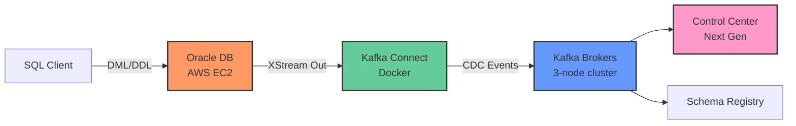

# 🚀 Oracle XStream CDC Connector Testing Environment

A comprehensive testing environment for the **Confluent Oracle XStream CDC Source Connector**, enabling real-time change data capture (CDC) from Oracle Database to Apache Kafka.

## 📋 Overview

This project provides a complete infrastructure for testing the Oracle XStream CDC Connector with various database changes and configurations. It combines:

- **☁️ AWS-hosted Oracle Database** - Deployed via Terraform with XStream Out configured
- **🐳 Local Confluent Platform** - Full-featured Kafka cluster running in Docker Compose
- **🔌 Oracle XStream CDC Connector** - Pre-configured to capture database changes in real-time

### Architecture



---

## 🎯 Objectives

This environment enables you to:

1. **Test CDC Capabilities** - Validate how different database operations (INSERT, UPDATE, DELETE, DDL) are captured and streamed to Kafka
2. **Edge Case Testing** - Experiment with complex scenarios like schema changes, large transactions, and data type variations
3. **Configuration Validation** - Test different connector configurations and observe their behavior
4. **Performance Analysis** - Monitor throughput, latency, and resource utilization using Control Center Next Gen
5. **Integration Testing** - Validate end-to-end data flow from Oracle to downstream consumers

---

## 🏗️ Infrastructure Components

### AWS Infrastructure (Terraform)

| Component | Description | Configuration |
|-----------|-------------|---------------|
| **Oracle Database** | Oracle XE 21c running in Docker on EC2 | t3.large instance with 30GB storage |
| **VPC & Networking** | Isolated network with public subnet | CIDR: 10.0.0.0/16 |
| **Security Groups** | Firewall rules for SSH, Oracle, and EM Express | Ports: 22, 1521, 5500 |
| **XStream Configuration** | Pre-configured outbound server | Server name: `XOUT` |

### Local Confluent Platform (Docker Compose)

| Service | Image | Ports | Purpose |
|---------|-------|-------|---------|
| **Broker 1-3** | cp-server:7.9.5 | 9092, 9094, 9095 | 3-node KRaft cluster (combined broker/controller) |
| **Schema Registry** | cp-schema-registry:7.9.5 | 8081 | Avro/JSON schema management |
| **Kafka Connect** | Custom (with Oracle libs) | 8083 | Runs Oracle XStream CDC connector |
| **Control Center** | cp-enterprise-control-center-next-gen:2.2.0 | 9021 | Monitoring and management UI |
| **REST Proxy** | cp-kafka-rest:7.9.5 | 8082 | HTTP interface to Kafka |
| **Prometheus** | cp-enterprise-prometheus:2.2.0 | 9090 | Metrics collection |
| **Alertmanager** | cp-enterprise-alertmanager:2.2.0 | 9093 | Alert management |

---

## 📦 Prerequisites

Before you begin, ensure you have:

- **AWS Account** with appropriate permissions
- **AWS CLI** configured with credentials
- **Terraform** >= 1.0
- **Docker** and **Docker Compose** installed locally
- **SSH key pair** for EC2 access
- **Confluent Cloud API credentials** (if using existing resources)

---

## 🚀 Step 1: Deploy Oracle Database in AWS

### 1.1 Configure Terraform Variables

Navigate to the Terraform directory and create a `terraform.tfvars` file:

```bash
cd tf
```

Create `terraform.tfvars` with your configuration:

```hcl
# AWS Region
region = "eu-west-1"

# Resource prefix
prefix = "test-xstream-connector"

# Oracle Database Configuration
oracle_db_name     = "XE"
oracle_db_user     = "c##cfltuser"
oracle_db_password = "My_RandomPass192837465"
oracle_db_port     = 1521
oracle_pdb_name    = "XEPDB1"

# XStream Configuration
oracle_xtream_outbound_server_name = "XOUT"
oracle_db_table_include_list       = "TESTING[.].*"

# Confluent Cloud (optional - only if using existing resources)
# confluent_cloud_api_key    = "your-api-key"
# confluent_cloud_api_secret = "your-api-secret"
```

### 1.2 Initialize and Deploy

```bash
# Initialize Terraform
terraform init

# Review the execution plan
terraform plan

# Deploy the infrastructure
terraform apply
```

> **⏱️ Deployment Time**: Approximately 10-15 minutes

### 1.3 Verify Oracle Database

Once deployment completes, Terraform will output connection details:

```bash
# View outputs
terraform output oracle_vm_db_details
terraform output oracle_xstream_connector
```

**Connect to the EC2 instance:**

```bash
# SSH into the instance (replace with your key and public IP)
ssh -i ~/.ssh/your-key.pem ec2-user@<EC2_PUBLIC_IP>

# Check Oracle container status
docker ps

# View setup logs
tail -f /var/log/script_debug.log
```

**Verify Oracle is healthy:**

```bash
# Check container health
docker inspect oracle-xe | grep -A 5 Health

# Connect to Oracle
docker exec -it oracle-xe sqlplus system/Welcome1@localhost:1521/XEPDB1
```

**Test XStream configuration:**

```sql
-- Connect as SYSDBA
CONNECT sys/Welcome1 AS SYSDBA

-- Verify XStream outbound server
SELECT SERVER_NAME, CONNECT_USER, SOURCE_DATABASE, CAPTURE_USER
FROM DBA_XSTREAM_OUTBOUND;

-- Should show: XOUT | c##cfltuser | XEPDB1 | ...

-- Verify the testing user exists
ALTER SESSION SET CONTAINER=XEPDB1;
SELECT USERNAME FROM DBA_USERS WHERE USERNAME = 'TESTING';
```

> [!IMPORTANT]
> The Oracle database is configured with:
> - **SYS password**: `Welcome1`
> - **XStream user**: `c##cfltuser` / `My_RandomPass192837465`
> - **Test schema**: `TESTING` (password: `password`)
> - **Outbound server**: `XOUT`

---

## 🐳 Step 2: Start Local Confluent Platform

### 2.1 Build Custom Connect Image

The Connect image requires Oracle Instant Client libraries:

```bash
# Return to project root
cd ..

# Build the custom Connect image
docker build -t custom-connect:latest .
```

This Dockerfile:
- Starts from `confluentinc/cp-server-connect:7.9.5`
- Installs `libaio` (required by Oracle client)
- Installs Oracle Instant Client 23.26.0.0

### 2.2 Start the Cluster

```bash
# Start all services
docker-compose up -d

# Monitor startup
docker-compose logs -f
```

**Startup sequence:**
1. Brokers initialize in KRaft mode (combined broker/controller)
2. Schema Registry connects to brokers
3. Connect worker starts and installs Oracle XStream connector
4. Control Center, Prometheus, and Alertmanager start

> **⏱️ Startup Time**: Approximately 2-3 minutes

### 2.3 Verify Cluster Health

**Check service status:**

```bash
# View all containers
docker-compose ps

# All services should show "Up" status
```

**Access Control Center:**

Open your browser to [http://localhost:9021](http://localhost:9021)

- Navigate to **Cluster Overview** - verify 3 brokers are healthy
- Check **Topics** - internal topics should be created
- View **Connect** - worker should be registered

**Verify Connect plugins:**

```bash
# List installed connectors
curl -s http://localhost:8083/connector-plugins | jq '.[] | select(.class | contains("Oracle"))'
```

Expected output:
```json
{
  "class": "io.confluent.connect.oracle.xstream.cdc.OracleXStreamSourceConnector",
  "type": "source",
  "version": "1.2.0"
}
```

> [!TIP]
> If Connect fails to start, check logs:
> ```bash
> docker logs connect
> ```
> Common issues: Oracle libraries not found, insufficient memory

---

## 🔌 Step 3: Deploy and Configure the Connector

### 3.1 Update Connector Configuration

Edit `etc/xstream-connector-config.json` with your Oracle database details:

```json
{
  "name": "OracleXStreamSourceConnector",
  "config": {
    "connector.class": "io.confluent.connect.oracle.xstream.cdc.OracleXStreamSourceConnector",
    "tasks.max": "1",

    "database.hostname": "<EC2_PUBLIC_DNS>",
    "database.port": "1521",
    "database.user": "c##cfltuser",
    "database.password": "My_RandomPass192837465",
    "database.dbname": "XE",
    "database.service.name": "XE",
    "database.pdb.name": "XEPDB1",
    "database.out.server.name": "XOUT",

    "topic.prefix": "xstream",
    "table.include.list": "TESTING[.].*",

    "schema.history.internal.kafka.topic": "__orcl-schema-changes.XEPDB1",
    "schema.history.internal.kafka.bootstrap.servers": "broker1:29092,broker2:29092,broker3:29092",

    "key.converter": "org.apache.kafka.connect.storage.StringConverter",
    "value.converter": "org.apache.kafka.connect.json.JsonConverter",

    "errors.log.enable": "true",
    "errors.log.include.messages": "true"
  }
}
```

> **🔑 Get EC2 Public DNS:**
> ```bash
> cd tf
> terraform output oracle_xstream_connector
> ```

### 3.2 Deploy the Connector

```bash
# Deploy connector via REST API
curl -X POST http://localhost:8083/connectors \
  -H "Content-Type: application/json" \
  -d @etc/xstream-connector-config.json
```

### 3.3 Monitor Connector Status

**Check connector status:**

```bash
# View connector status
curl -s http://localhost:8083/connectors/OracleXStreamSourceConnector/status | jq
```

Expected output:
```json
{
  "name": "OracleXStreamSourceConnector",
  "connector": {
    "state": "RUNNING",
    "worker_id": "connect:8083"
  },
  "tasks": [
    {
      "id": 0,
      "state": "RUNNING",
      "worker_id": "connect:8083"
    }
  ]
}
```

**View connector logs:**

```bash
docker logs connect | grep -i oracle
```

**In Control Center:**

1. Navigate to **Connect** → **connect-default**
2. Click on **OracleXStreamSourceConnector**
3. View **Status**, **Configuration**, and **Tasks**

> [!WARNING]
> If the connector shows `FAILED` state, common issues include:
> - Incorrect database hostname/credentials
> - Network connectivity issues (check security groups)
> - XStream server not properly configured
> - Missing Oracle client libraries

---

## 📊 Step 4: Test Data Flow

### 4.1 Create a Test Table

Connect to Oracle and create a table in the `TESTING` schema:

```bash
# SSH to EC2 instance
ssh -i ~/.ssh/your-key.pem ec2-user@<EC2_PUBLIC_IP>

# Connect to Oracle as TESTING user
docker exec -it oracle-xe sqlplus testing/password@localhost:1521/XEPDB1
```

```sql
-- Create a sample table
CREATE TABLE TESTING.EMPLOYEES (
    EMPLOYEE_ID NUMBER(6) PRIMARY KEY,
    FIRST_NAME VARCHAR2(50),
    LAST_NAME VARCHAR2(50),
    EMAIL VARCHAR2(100),
    HIRE_DATE DATE,
    SALARY NUMBER(8,2),
    DEPARTMENT VARCHAR2(50)
);

-- Verify table creation
DESC TESTING.EMPLOYEES;
```

### 4.2 Insert Test Data

```sql
-- Insert sample records
INSERT INTO TESTING.EMPLOYEES VALUES
(1, 'John', 'Doe', 'john.doe@example.com', SYSDATE, 75000.00, 'Engineering');

INSERT INTO TESTING.EMPLOYEES VALUES
(2, 'Jane', 'Smith', 'jane.smith@example.com', SYSDATE, 82000.00, 'Marketing');

INSERT INTO TESTING.EMPLOYEES VALUES
(3, 'Bob', 'Johnson', 'bob.johnson@example.com', SYSDATE, 68000.00, 'Sales');

-- Commit the transaction
COMMIT;
```

### 4.3 Verify Data in Kafka

**List topics:**

```bash
# From your local machine
docker exec -it broker1 kafka-topics --bootstrap-server broker1:29092 --list | grep xstream
```

Expected topic: `xstream.TESTING.EMPLOYEES`

**Consume messages:**

```bash
# Consume from the beginning
docker exec -it broker1 kafka-console-consumer \
  --bootstrap-server broker1:29092 \
  --topic xstream.TESTING.EMPLOYEES \
  --from-beginning \
  --property print.key=true \
  --property print.timestamp=true
```

**Expected output format:**

```json
{
  "before": null,
  "after": {
    "EMPLOYEE_ID": 1,
    "FIRST_NAME": "John",
    "LAST_NAME": "Doe",
    "EMAIL": "john.doe@example.com",
    "HIRE_DATE": 1733400000000,
    "SALARY": 75000.00,
    "DEPARTMENT": "Engineering"
  },
  "source": {
    "version": "1.2.0",
    "connector": "oracle-xstream",
    "name": "xstream",
    "ts_ms": 1733400123456,
    "snapshot": "false",
    "db": "XE",
    "schema": "TESTING",
    "table": "EMPLOYEES",
    "txId": "5.23.456",
    "scn": "1234567",
    "commit_scn": "1234568"
  },
  "op": "c",
  "ts_ms": 1733400123789
}
```

### 4.4 Test UPDATE Operations

```sql
-- Update a record
UPDATE TESTING.EMPLOYEES
SET SALARY = 80000.00, DEPARTMENT = 'Senior Engineering'
WHERE EMPLOYEE_ID = 1;

COMMIT;
```

**Verify in Kafka:**

The message will contain both `before` and `after` states:

```json
{
  "before": {
    "EMPLOYEE_ID": 1,
    "SALARY": 75000.00,
    "DEPARTMENT": "Engineering"
  },
  "after": {
    "EMPLOYEE_ID": 1,
    "SALARY": 80000.00,
    "DEPARTMENT": "Senior Engineering"
  },
  "op": "u"
}
```

### 4.5 Test DELETE Operations

```sql
-- Delete a record
DELETE FROM TESTING.EMPLOYEES WHERE EMPLOYEE_ID = 3;

COMMIT;
```

**Verify in Kafka:**

```json
{
  "before": {
    "EMPLOYEE_ID": 3,
    "FIRST_NAME": "Bob",
    "LAST_NAME": "Johnson"
  },
  "after": null,
  "op": "d"
}
```

### 4.6 Monitor in Control Center

1. Open [http://localhost:9021](http://localhost:9021)
2. Navigate to **Topics** → `xstream.TESTING.EMPLOYEES`
3. Click **Messages** to view CDC events in real-time
4. Observe:
   - Message throughput
   - Schema evolution
   - Partition distribution
   - Consumer lag (if you have consumers)

---

## 🧪 Advanced Testing Scenarios

### Schema Changes (DDL)

```sql
-- Add a new column
ALTER TABLE TESTING.EMPLOYEES ADD (PHONE_NUMBER VARCHAR2(20));

-- Insert data with new column
INSERT INTO TESTING.EMPLOYEES VALUES
(4, 'Alice', 'Williams', 'alice@example.com', SYSDATE,
 90000.00, 'Engineering', '555-1234');
COMMIT;
```

Check the schema history topic:
```bash
docker exec -it broker1 kafka-console-consumer \
  --bootstrap-server broker1:29092 \
  --topic __orcl-schema-changes.XEPDB1 \
  --from-beginning
```

### Bulk Operations

```sql
-- Insert 1000 records
BEGIN
  FOR i IN 1..1000 LOOP
    INSERT INTO TESTING.EMPLOYEES VALUES
    (i+100, 'User'||i, 'Test'||i, 'user'||i||'@test.com',
     SYSDATE, 50000 + (i*100), 'Department'||MOD(i,5));
  END LOOP;
  COMMIT;
END;
/
```

Monitor throughput in Control Center.

### Complex Data Types

```sql
-- Create table with various data types
CREATE TABLE TESTING.DATA_TYPES_TEST (
    ID NUMBER PRIMARY KEY,
    TEXT_COL VARCHAR2(100),
    NUMBER_COL NUMBER(10,2),
    DATE_COL DATE,
    TIMESTAMP_COL TIMESTAMP,
    CLOB_COL CLOB,
    BLOB_COL BLOB
);

-- Insert test data
INSERT INTO TESTING.DATA_TYPES_TEST VALUES (
    1,
    'Sample Text',
    12345.67,
    SYSDATE,
    SYSTIMESTAMP,
    TO_CLOB('Large text content...'),
    HEXTORAW('DEADBEEF')
);
COMMIT;
```

---

## 📈 Monitoring and Troubleshooting

### Key Metrics to Monitor

| Metric | Location | What to Watch |
|--------|----------|---------------|
| **Connector Status** | Control Center → Connect | Should be `RUNNING` |
| **Task Status** | Connect REST API | All tasks `RUNNING` |
| **Source Records** | Control Center → Connector Metrics | Increasing count |
| **Broker Throughput** | Control Center → Brokers | Messages/sec |
| **Consumer Lag** | Control Center → Consumers | Should be near zero |

### Common Issues

#### Connector Fails to Start

```bash
# Check Connect logs
docker logs connect | tail -100

# Common causes:
# - Oracle libraries missing: Rebuild Docker image
# - Network issues: Check security groups allow port 1521
# - Credentials wrong: Verify in terraform.tfvars
```

#### No Messages in Kafka

```bash
# Verify XStream is capturing
docker exec -it oracle-xe sqlplus sys/Welcome1 as sysdba

SELECT CAPTURE_NAME, STATE, TOTAL_MESSAGES_CAPTURED
FROM V$XSTREAM_CAPTURE;

# If TOTAL_MESSAGES_CAPTURED is 0, check:
# - Table matches include regex: TESTING[.].*
# - Supplemental logging enabled
# - Transactions are committed
```

#### Performance Issues

```sql
-- Check XStream lag
SELECT APPLY_NAME,
       APPLY_TIME,
       APPLIED_MESSAGE_NUMBER,
       APPLIED_MESSAGE_CREATE_TIME
FROM DBA_XSTREAM_APPLY;

-- If lag is high:
-- - Increase tasks.max in connector config
-- - Add more Connect workers
-- - Optimize Oracle performance
```

### Useful Commands

```bash
# Restart connector
curl -X POST http://localhost:8083/connectors/OracleXStreamSourceConnector/restart

# Delete connector
curl -X DELETE http://localhost:8083/connectors/OracleXStreamSourceConnector

# View Connect worker config
curl -s http://localhost:8083/ | jq

# Check broker health
docker exec broker1 kafka-broker-api-versions \
  --bootstrap-server broker1:29092

# View all topics
docker exec broker1 kafka-topics \
  --bootstrap-server broker1:29092 --list
```

---

## 🧹 Cleanup

### Stop Local Environment

```bash
# Stop all containers
docker-compose down

# Remove volumes (WARNING: deletes all data)
docker-compose down -v

# Remove custom image
docker rmi custom-connect:latest
```

### Destroy AWS Infrastructure

```bash
cd tf

# Destroy all AWS resources
terraform destroy

# Confirm with: yes
```

> [!CAUTION]
> This will permanently delete the Oracle database and all data!

---

## 📚 Additional Resources

### Documentation

- [Oracle XStream CDC Connector Documentation](https://docs.confluent.io/kafka-connectors/oracle-xstream/current/overview.html)
- [Oracle XStream Concepts](https://docs.oracle.com/en/database/oracle/oracle-database/21/xstrm/)
- [Confluent Platform Documentation](https://docs.confluent.io/platform/current/overview.html)
- [Control Center Next Gen](https://docs.confluent.io/platform/current/control-center/index.html)

### Configuration Reference

- **Connector Properties**: See [etc/xstream-connector-config.json](etc/xstream-connector-config.json)
- **Terraform Variables**: See [tf/variables.tf](tf/variables.tf)
- **Docker Compose**: See [docker-compose.yml](docker-compose.yml)


---

## 📝 License

This project is provided as-is for testing and educational purposes.
